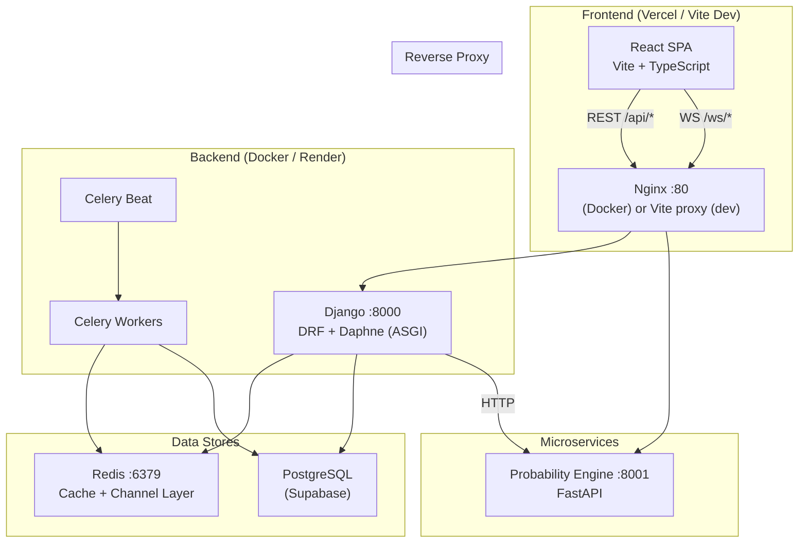
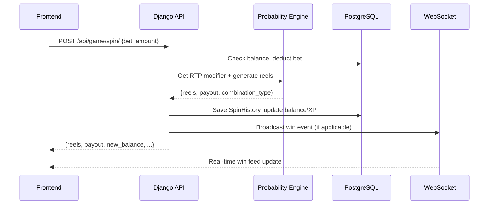

# Sinistrinha — Architecture Overview

## System Diagram



## Service Map

| Service            | Port  | Technology         | Responsibility                      |
|--------------------|-------|--------------------|--------------------------------------|
| Frontend           | 3000  | React + Vite       | SPA, user interaction                |
| Backend (web)      | 8000  | Django + Daphne    | REST API, WebSocket, Auth            |
| Probability Engine | 8001  | FastAPI            | Weighted reel spins, RTP control     |
| Redis              | 6379  | Redis 7            | Channel layer, Celery broker, cache  |
| PostgreSQL         | 5432  | Supabase PG        | Persistent data                      |
| Nginx              | 80    | Nginx              | Reverse proxy (production only)      |

## API Endpoint Map

### Authentication (`/api/auth/`)
| Method | Endpoint               | Auth? | Description          |
|--------|------------------------|-------|----------------------|
| POST   | `/api/auth/login/`     | No    | JWT token pair       |
| POST   | `/api/auth/register/`  | No    | Create user account  |
| POST   | `/api/auth/refresh/`   | No    | Refresh access token |
| POST   | `/api/auth/logout/`    | Yes   | Blacklist refresh    |

### User (`/api/user/`)
| Method | Endpoint               | Auth? | Description           |
|--------|------------------------|-------|-----------------------|
| GET    | `/api/user/profile/`   | Yes   | Current user profile  |
| GET    | `/api/user/leaderboard/` | No  | Top players by balance|

### Game (`/api/game/`)
| Method | Endpoint                   | Auth? | Description              |
|--------|----------------------------|-------|--------------------------|
| POST   | `/api/game/spin/`          | Yes   | Execute a slot spin      |
| GET    | `/api/game/jackpot/`       | No    | Current jackpot amount   |
| GET    | `/api/game/recent-wins/`   | No    | Latest winning spins     |
| GET    | `/api/game/level-config/`  | No    | All level configurations |
| GET    | `/api/game/free-spins/`    | Yes   | User free spins info     |
| GET    | `/api/game/level-progress/`| Yes   | User level/XP progress   |
| GET    | `/api/game/user/history/`  | Yes   | User spin history        |

### Payments (`/api/payments/`)
| Method | Endpoint                     | Auth? | Description           |
|--------|------------------------------|-------|-----------------------|
| POST   | `/api/payments/deposit/`     | Yes   | Add funds             |
| POST   | `/api/payments/withdraw/`    | Yes   | Request withdrawal    |
| GET    | `/api/payments/transactions/`| Yes   | Transaction history   |

### WebSocket Channels
| Path                    | Auth?  | Description                      |
|-------------------------|--------|----------------------------------|
| `/ws/casino/`           | No     | Public: live wins, jackpot updates|
| `/ws/user/{user_id}/`   | Yes*   | Private: balance, level-up, etc. |

> *JWT token passed via query string: `?token=<access_token>`

## Data Flow: Spin Lifecycle



## Directory Structure

```
Sinistrinha/
├── apps/
│   ├── casino/          # WebSocket consumers
│   ├── game/            # Core game logic (spin, levels, bonuses)
│   ├── integrations/    # Supabase client wrapper
│   ├── payments/        # Deposit/withdraw/transaction models
│   └── users/           # Auth, profile, leaderboard
├── frontend/
│   ├── src/
│   │   ├── components/  # Reusable UI components
│   │   ├── lib/         # API client (axios + JWT interceptor)
│   │   ├── pages/       # Route pages
│   │   ├── store/       # Zustand stores (auth, game, casino)
│   │   └── types/       # TypeScript interfaces
│   └── .env             # Frontend env vars
├── probability_engine/  # FastAPI microservice
├── sinistrinha/         # Django project config
│   └── settings/        # base, dev, prod settings
├── .github/workflows/   # CI/CD pipeline
├── docker-compose.yml   # Container orchestration
├── nginx.conf           # Reverse proxy config
└── .env.example         # Environment variable template
```

## Authentication Flow

1. **Login:** Frontend sends `POST /api/auth/login/` with `{username, password}`
2. **Token Storage:** Access + refresh tokens stored in `localStorage`
3. **Request Auth:** Axios interceptor adds `Authorization: Bearer <token>` to all `/api/` requests
4. **Token Refresh:** On 401 response, interceptor calls `/api/auth/refresh/` automatically
5. **WebSocket Auth:** JWT passed via query string `?token=<access_token>` for private channels
6. **Logout:** Calls `/api/auth/logout/` to blacklist refresh token, clears local storage
